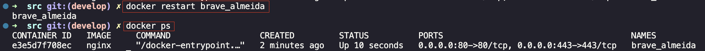
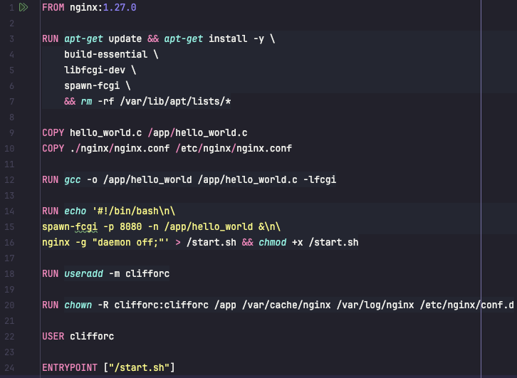

# Simple Docker

Этот проект представляет собой введение в Docker, фокусируясь на разработке простого Docker-образа для собственного сервера.

Данный проект является частью образовательной программы [School21](https://21-school.ru/) (образовательный проект от Сбер для разработчиков)

# Содержание

1. [Part 1. Готовый докер](#part-1-готовый-докер)
2. [Part 2. Операции с контейнером](#part-2-операции-с-контейнером)
3. [Part 3. Мини веб-сервер](#part-3-мини-веб-сервер)
4. [Part 4. Свой докер](#part-4-свой-докер)
5. [Part 5. Dockle](#part-5-dockle)
6. [Part 6. Базовый Docker Compose](#part-6-базовый-docker-compose)

<link rel="stylesheet" type="text/css" href="misc/styles.css">

## Part 1. Готовый докер

- Берем официальный докер-образ с **nginx** и выкачиваем его при помощи `docker pull`:

- Проверяем наличие докер-образа через `docker images`:

- Запускаем докер-образ через `docker run -d [image_id]`:

- Проверяем, что образ запустился через `docker ps`:

- Смотрим информацию о контейнере через `docker inspect [container_id|container_name]` чтобы определить:
    - размер контейнера;
    - список замапленных портов;
    - ip контейнера.

Информации о размере контейнера в данном отчете нет (есть в выводе команды `docker images`):

- Остановливаем докер контейнер через `docker stop [container_name]`:

- Проверяем, что контейнер остановился через `docker ps`:

- Запускаем докер с портами 80 и 443 в контейнере, замапленными на такие же порты на локальной машине, через команду `docker run -d -p 80:80 -p 443:443 nginx`:

- Проверяем, что в браузере по адресу *localhost:80* доступна стартовая страница **nginx**:

- Перезапускаем докер контейнер через `docker restart [container_name]` и проверяем что контейнер запустился:

## Part 2. Операции с контейнером

- Читаем конфигурационный файл nginx.conf внутри докер контейнера через команду `exec`:

- Создаем на локальной машине файл `vim nginx.conf`:

- Настраиваем в нем по пути `/status` отдачу страницы статуса сервера `nginx`:

- Копируем созданный файл `nginx.conf` внутрь докер-образа через команду `docker cp`:

- Перезапускаем `nginx` внутри докер-образа через команду `exec`:

- Проверяем, что по адресу `localhost:80/status` отдается страничка со статусом сервера `nginx`:

- Экспортируем контейнер в файл `container.tar` через команду `export`:

- Останавливаем контейнер:

- Удаляем образ через `docker rmi [image_id|repository]`, не удаляя перед этим контейнеры:

- Удаляем остановленный контейнер:

- Импортируем контейнер обратно через команду `import`:

- Запускаем импортированный контейнер:

 

- Проверяем, что по адресу `localhost:80/status` отдается страничка со статусом сервера `nginx`:

## Part 3. Мини веб-сервер

- Напишем мини-сервер на **C** и **FastCgi**, который будет возвращать простейшую страничку с надписью `Hello World!` и сохраняем в `hello_world.c`:

- Устанавливаем `FastCgi` `brew install fcgi`
- Компилируем файл `gcc -o hello_world hello_world.c -lfcgi` или на macos с указанием пути `gcc -o hello_world hello_world.c -I/opt/homebrew/Cellar/fcgi/2.4.2/include -L/opt/homebrew/Cellar/fcgi/2.4.2/lib -lfcgi`
- Устанавливаем `spawn-fcgi` `brew install spawn-fcgi`
- Запускаем написанный мини-сервер через *spawn-fcgi* на порту 8080:

- Напишем свой *nginx.conf*, который будет проксировать все запросы с 81 порта на *127.0.0.1:8080*:

  

- Запускаем `nginx` командой `nginx -c ./nginx/nginx.conf`:

  

- Проверяем, что в браузере по *localhost:81* отдается написанная нами страничка:

  

## Part 4. Свой докер

- Пишем свой докер-образ (создаем Dockerfile), который:
    - собирает исходники мини сервера на FastCgi из `Part 3`;
    - запускает его на 8080 порту;
    - копирует внутрь образа написанный *./nginx/nginx.conf*;
    - запускает **nginx**.

- Собираем написанный докер-образ через `docker build`, указываем имя `nginx_fastcgi` и тег `latest`:

- Проверяем через `docker images`, что все собралось корректно:

- Запускаем собранный докер-образ с маппингом 81 порта на 80 на локальной машине и маппингом папки `./nginx/` внутрь контейнера по адресу `/etc/nginx/`:

- Проверяем, что по `localhost:80` доступна страничка написанного мини сервера:

- Дописываем в `./nginx/nginx.conf` проксирование странички `/status`, по которой надо отдавать статус сервера `nginx`:

- Перезапускаем докер-образ:

- Проверяем, что теперь по адресу `localhost:80/status` отдается страничка со статусом `nginx`:

## Part 5. **Dockle**

- Просканируем образ из предыдущего задания через `dockle [image_id|repository]`:

- Для исправления ошибок выполним:
    - `FATAL CIS-DI-0010: Do not store credential in environment` исправим ошибку добавлением флагов `dockle -ak NGINX_GPGKEY -i CIS-DI-0010`;
    - `FATAL DKL-DI-0005: Clear apt-get caches` нужно добавить правило очистки apt-get кэша `rm -rf /var/lib/apt/lists/*` при сборке образа;
    - `WARN CIS-DI-0001: Create a user for the container` нужно добавить создание пользователя без root прав от имени которого будет выполняться запуск;
    - `WARN DKL-DI-0006: Avoid latest tag` тэг `latest` заменяем на последнюю версию сборки `1.27.0`;

- Вносим изменения в сборку `Dockerfile`:

- Пересобираем образ и запускаем контейнер:

- Заного сканируем образ через `dockle -ak NGINX_GPGKEY -i CIS-DI-0010 [image_id|repository]` и проверяем что ошибок и предупреждений нет:

## Part 6. Базовый **Docker Compose**

- Напишем файл *docker-compose.yml*, с помощью которого:
    - Поднимем докер-контейнер из Части 5 в локальной сети;
    - Поднимем докер-контейнер с **nginx**, который будет проксировать все запросы с 8080 порта на 81 порт первого контейнера.
- Замапим 8080 порт второго контейнера на 80 порт локальной машины:

Содержание файла `docker-compose.yml`:

Содержание файла `nginx.conf` для докер-контейнера с **nginx**:

- Останавливаем все запущенные контейнеры командой `docker stop $(docker ps -q)`.
- Собираем проект с помощью команды `docker-compose build`:

- Запускаем проект с помощью команды `docker-compose up`:

- Проверяем, что в браузере по `localhost:80` отдается страница `Hello World!`:

